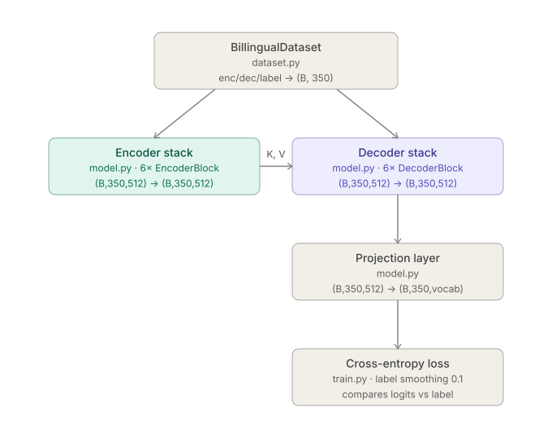
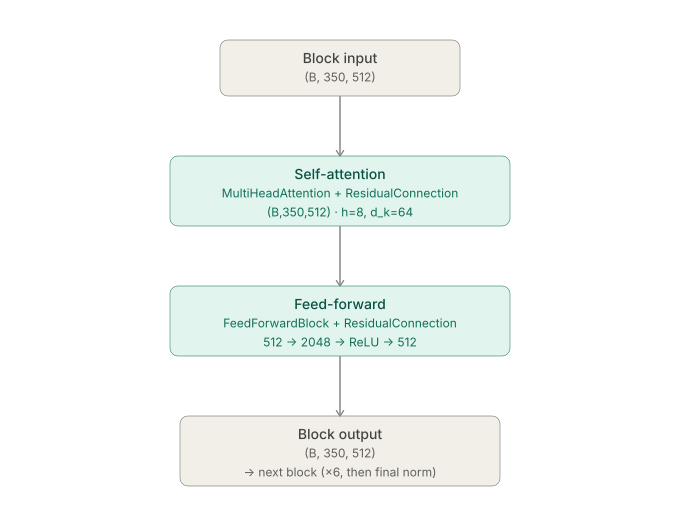
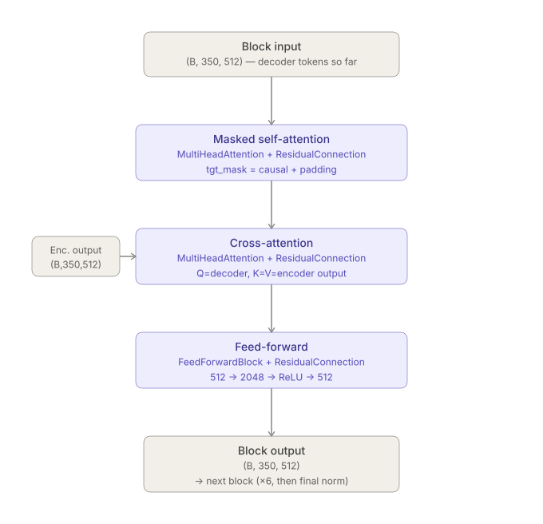

## Why Rebuild the Transformer From Scratch?

There's no shortage of transformer tutorials floating around. It's the most basic deep learning architecture in NLP today, so why bother building one from scratch again?

Because it's exactly that: the basic building block for almost every architecture running today. I spend my actual working hours around fast-conformer models and diffusion models, but actually building this basic transformer with my own hands (and several 2am debugging sessions) turned out to be very different and suprisingly very insightful. Enough that I decided I had to write a log about it.

So here's that log. I built an encoder-decoder transformer straight from the original paper, trained it on `opus_books` for English to Italian translation, and kept a running list of every question that had me pausing mid-line wondering what the authors were thinking.

The source lives in four files: `model.py` for the architecture, `dataset.py` for the data pipeline, `config.py` for the hyperparameters, and `train.py` for the training loop. [code link](https://github.com/Ashley936/Transformers_expt/tree/main/Transformers)

## Architecture at a Glance

Six encoder blocks feed a stack of six decoder blocks through cross-attention, exactly as in the 2017 paper. `d_model = 512`, `h = 8` heads, `d_ff = 2048`, `max_seq_len = 350`, `dropout = 0.1`.

{height="400px"}

::: {layout-ncol=2 layout-valign="bottom"}
{width="1600px"}

{width="1600px"}
:::

## 1. Text Embeddings: Turning Tokens Into Vectors

Let $W_E \in \mathbb{R}^{V \times d_{model}}$ be the learnable embedding weight matrix.  
The text embedding formula for a given token at position $pos$ with vocabulary index $k$ is:
$$E_{pos} = W_E[k] \cdot \sqrt{d_{model}}$$

`nn.Embedding` is just a lookup table: `[vocab_size, d_model]`, initialized randomly and learned during training. During forward pass :- `[batch, seq_len]` -> `[batch, seq_len, d_model]` 

::: {.callout-tip title="Q1: Why multiply by √d_model?"}
The positional encodings (next section) have values bounded in `[-1, 1]`. Raw embeddings, especially right after Xavier init, sit at a much smaller scale.  
`√d_model` scale-up the text embeddings that becomes comparable to the **additive positional signal** early in training.
:::

## 2. Positional Encoding: Giving the Model a Sense of Order

Formulas:-  
For even dimensions ($2i$):
$$PE_{(pos, 2i)} = \sin\left(\frac{pos}{10000^{\frac{2i}{d_{model}}}}\right)$$
For odd dimensions ($2i + 1$):
$$PE_{(pos, 2i+1)} = \cos\left(\frac{pos}{10000^{\frac{2i}{d_{model}}}}\right)$$
$i$ is a specific feature dimension (where $i$ goes from $0$ to $d_{model}/2$)

::: {.callout-note title="Positional Encoding: Use of sin and cos"}
The maths behind chosing sin and cos, it's pros and cons and recent advancements in positional encoding is discussed in my other blog: [link: to be done]
:::

Two implementation details:

- **`register_buffer`, not `nn.Parameter`:** Registering in buffer allows the deterministic embeddings that never gets trained to be moved with the model across `.to(device)` calls and be saved/restored in `state_dict()`. 
- **The `e^(ln(A)B)` trick: ** `10000^(-2i/d_model)` is computed as `exp(-2i/d_model * ln(10000))` because `torch.pow` on a fractional, negative exponent across a whole tensor is less numerically stable than composing `exp` and `log`, which PyTorch has fast, stable kernels for.

$$X_{final} = \text{Dropout}\Big( E_{pos} + PE_{pos} \Big)$$

::: {.callout-note title="Knowledge point :- Use of dropout across the Transformer paper"}
The information in the original paper is a bit scattered, so here's a summary of where dropout is applied:
[Link](../transformer-from-scratch-2/#honourable-mentions-dropout-layers-they-are-everywhere)
:::

## 3. LayerNorm From Scratch

::: {.callout-tip title="Q2: What is the use of Normalization?"}
As data moves non-linear activations and weight multiplications leads to **Internal Covariate Shift**.  

- The variance of the activations grows too large -> the **gradients explode**
- It shrinks too much -> the **gradients vanish**  
Normalization solves this by forcing the activations back to a standard scale (typically a mean of 0 and a variance of 1) at every layer. The general mathematical formula for normalization is:
$$y = \frac{x - \mu}{\sqrt{\sigma^2 + \epsilon}} \cdot \gamma + \beta$$
:::

::: {.callout-tip title="Q3: Why LayerNorm and why not BatchNorm?"}

**BatchNorm** normalizes across **batch** dimension and assumes batch statistics are stable and representative. Two things break that assumption here:

- **Variable sequence lengths + padding: ** Batch statistics get polluted by padding tokens that are used to fill sequences to the same length.
- **Batch size of 1 at inference:** BatchNorm's statistics are undefined (or at best a single noisy sample) at batch size 1.

LayerNorm is better here because it normalizes across the *feature* dimension (`d_model`) independently per token, so it behaves identically whether the batch is 1 sentence or 64.
:::

## 4. Multi-Head Attention

$$\text{Attention}(Q, K, V) = \text{softmax}\left(\frac{Q K^T}{\sqrt{d_k}}\right) V$$

1. `q`, `k`, `v` start as `[batch, seq_len, d_model]`.  
2. Then first it is converted to `[batch, seq_len, h, d_k]` (`d_k = d_model/h`)  
3. And then transposed to`[batch, h, seq_len, d_k]`  
    **WHY????** **-> Allows each head to take info from all the seq tokens**
3. After attention, `.transpose(1, 2).contiguous().view(...)` merges the heads back. 
`.contiguous()` is required here because `.transpose` returns a view with non-contiguous memory, and `.view()` refuses to operate on that.

::: {.callout-important title="Q4: Why divide by √d_k? What happens if you don't?"}
Assume the components of `q` and `k` are roughly independent with mean 0 and variance 1 (a reasonable approximation right after Xavier/careful init). The dot product `q·k` sums `d_k` such independent products, so its variance grows to `Var(q·k) ≈ d_k` - the standard deviation grows as `√d_k`.

And when passed through softmax, it is exponentiated and output collapse towards one-hot. (ex output: `[0.999, 0.001, 0.000]`)
The gradient of softmax with respect to its logits is roughly `p(1-p)`, which is **near zero** for entries pinned near 0 or 1. So your gradients completely die. Your model just sits there, learning nothing.

Dividing by `√d_k` renormalizes the dot product back to unit variance regardless of `d_k` and prevents gradient collapse.
:::

## 5. The FeedForward Block

Two linear transformations with a ReLU activation in between. (512 -> 2048 -> RELU -> 512)
`FFN(x) = max(0, W·x + b1)W2 + b2`
This block is applied pointwise.  
Each token, in isolation, does its own nonlinear processing on what it just gathered.

::: {.callout-tip title="Q5: Why is there dropout inside the FFN in modern approaches?"}
The dropout *inside* the FFN, between `linear_1` and `linear_2`, is a modern addition.

Why it matters: `d_ff` is 4× `d_model`. Here, neurons can co-adapt (learn to always fire together to reproduce memorized patterns). A dropout is applied in the residual connection but it only acts on the *compressed* final output and can't see or break up that internal co-adaptation. Internal FFN dropout regularizes the expanded space directly.

| Scenario | Internal FFN dropout needed? |
|---|---|
| Small model, small `d_ff` | Not much, residual dropout is enough |
| Large model, large `d_ff` | Yes, co-adaptation risk grows with size |
| Fine-tuning on small datasets | Yes, overfitting risk is real |
| Large-scale pretraining | Often removed, data volume is the regularizer |

:::

---

Pheww !! That was a lot. But it's not over yet. Here is the next post that starts form Residual connections (The real magic of the transformers) and goes on to explain the design choices, introduce masking and then moves onto different training nuances. [link](../transformer-from-scratch-2/index.qmd)